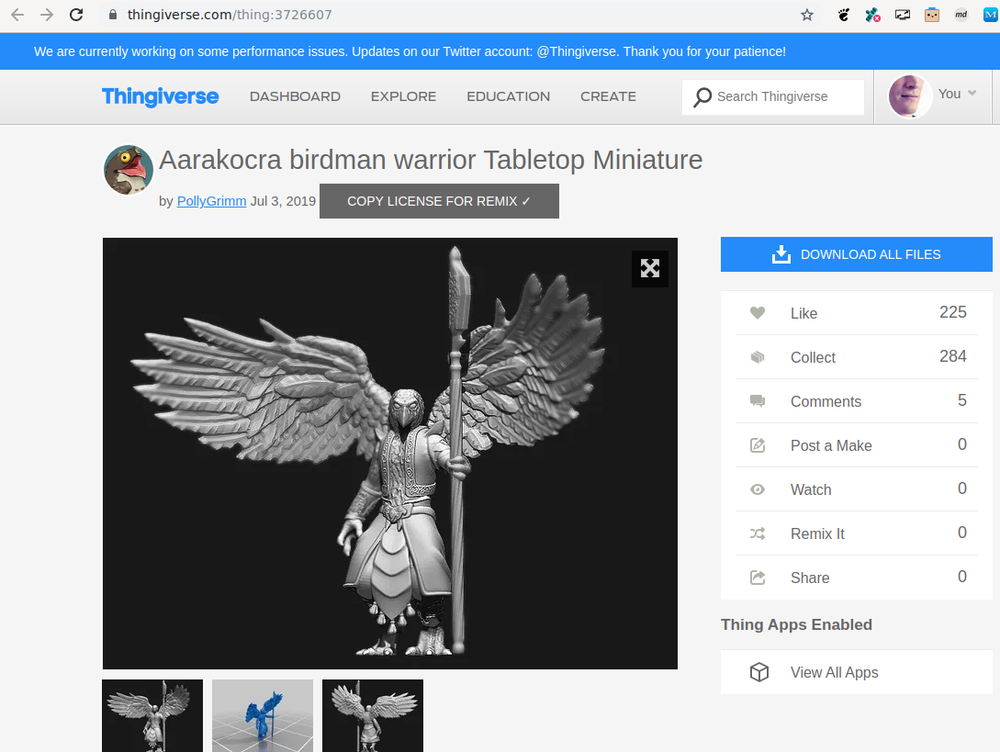

# Thing Remix Attribution Maker
https://greasyfork.org/en/scripts/394594-thing-remix-attribution-maker
by [Poikilos](https://poikilos.org)

This script adds a button by the author and date of a thing page on Thingiverse. Clicking the button gathers information from that section and the license section, such as the thing name, post date, author, license, and the URLs for all four where possible. The information is formatted as a markdown "## License" section that you can add to your README or thing description for your remix. Just add your username in the space provided ("&lt;insert remixer's name here&gt;").

## Screenshot 1

A checkbox appears on the button if copying was successful.

## Screenshot 2

This example markdown is what you would get from the page in the other screenshot.
